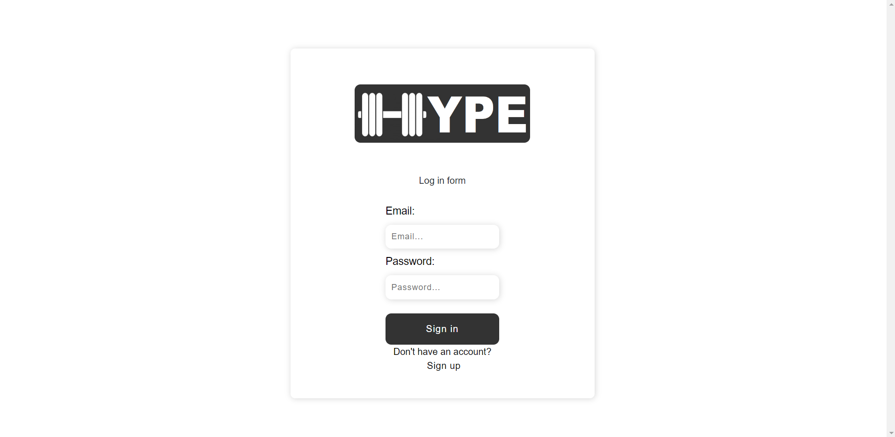
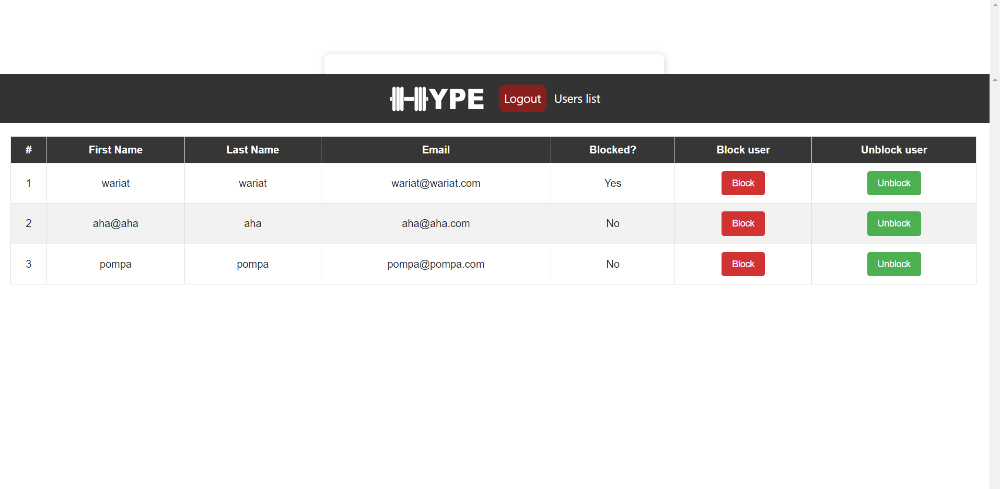
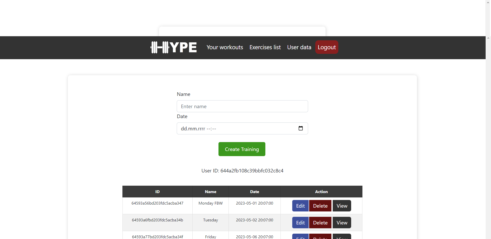
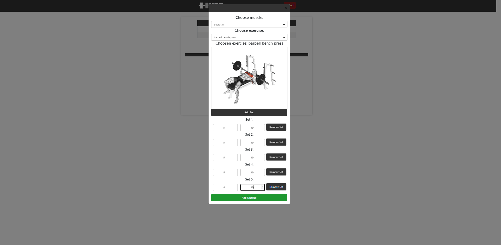
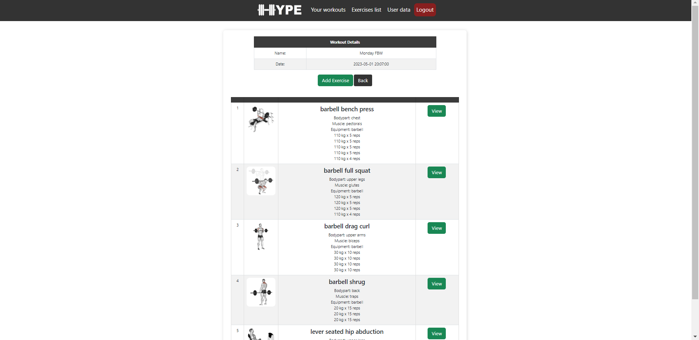
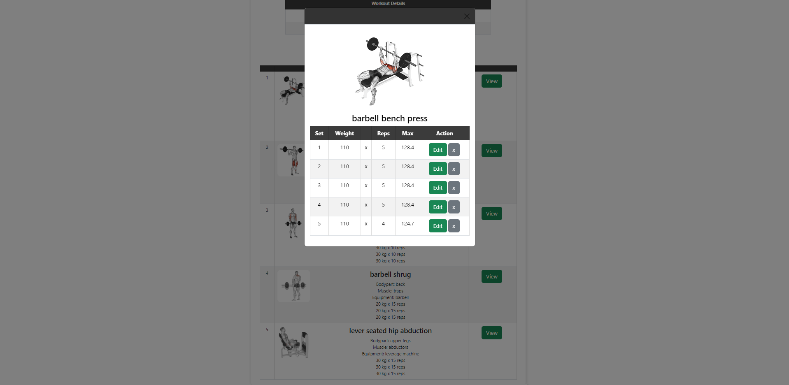
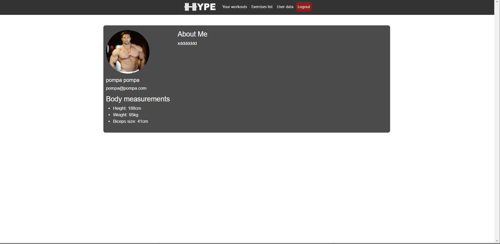

# WORK IN PROGRESS

HYPE is a fitness app that helps users plan, track and analyze their workouts at the gym. 
The application contains many functionalities such as: 
- library of exercises with illustrations and descriptions; 
- the ability to create your own training plans; 
- tracking progress and performed exercises.

Login and register page (authentication):

Admin panel (the ability to block the user (the user cannot log in to the site):

