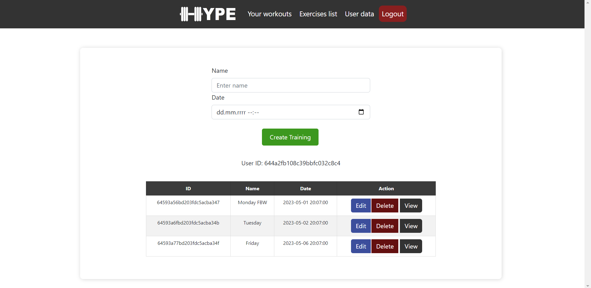

MERN APP - MONGODB, EXPRESS.JS, REACT.JS, NODE.JS, React-Bootstrap and some CSS.

HYPE is a fitness app that helps users plan, track and analyze their workouts at the gym. 
The application contains many functionalities such as: 
- library of exercises with illustrations and descriptions; 
- the ability to create your own training plans; 
- tracking progress and performed exercises.

# Login and register page (authentication):

# Workout creator:

# Adding exercises to the selected workout (ability to filter exercises by target muscle or name): 

# Overview of all exercises performed in the training

# Possibility to preview the parameters of a specific performed exercise

# User profile

# Future plans:
The application will also allow you to browse the database of exercises, 
where instructions, gifs and photos on how to properly perform the selected exercise will be available
